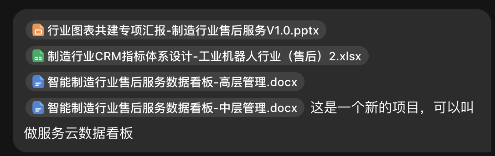
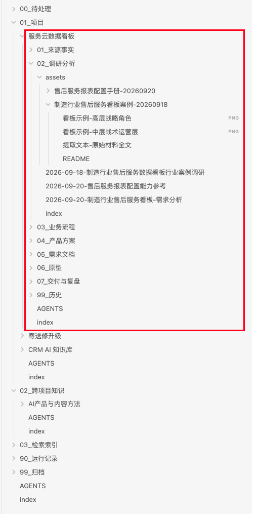
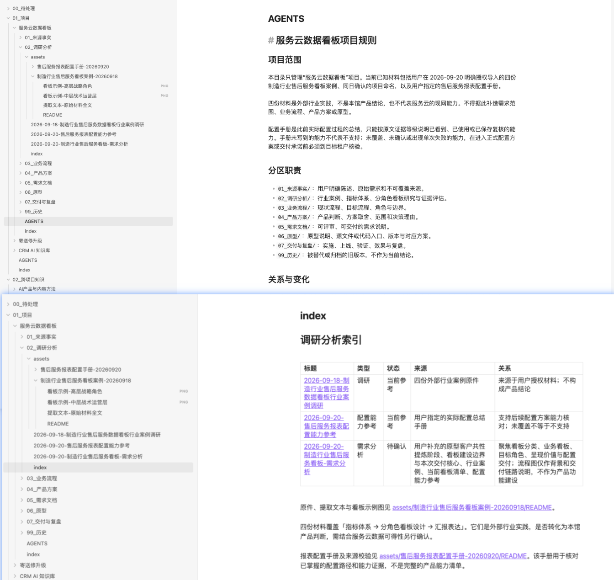

# AI Product Manager Skills

一组面向 AI 产品经理和个人知识工作者的可复用 Agent Skills。

这些 Skill 不只是生成一篇文档，而是把重复性的产品工作、知识管理和交付流程，变成 AI Agent 可以持续执行的工作方式。

## 当前 Skills

| Skill | 用途 | 安装位置 |
| --- | --- | --- |
| [`ai-pm-prd-writer`](skills/ai-pm-prd-writer/) | 将产品想法、截图、会议记录、用户反馈或已有上下文整理为结构化 PRD 草稿 | [`skills/ai-pm-prd-writer/`](skills/ai-pm-prd-writer/) |
| [`building-knowledge-bases-zh`](skills/building-knowledge-bases-zh/) | 建立可由 AI 持续读取、沉淀、追溯和联动维护的个人知识体系 | [`skills/building-knowledge-bases-zh/`](skills/building-knowledge-bases-zh/) |

## AI 持续知识管理 Skill

### AI 会写文档，但还不会管理知识

现在的 AI 已经很会生成单篇内容了：PRD、会议纪要、研究报告、文章和方案都可以快速产出。

但下一次变化发生时，问题就来了：

- 这条新信息应该放在哪里？
- 它和已有的哪些内容有关？
- 原来的判断是不是应该调整？
- 哪些文档需要一起修改？
- 哪些历史内容不能被覆盖？
- 如果只修改眼前这一篇，会不会让整个知识库出现矛盾？

`building-knowledge-bases-zh` 解决的不是“让 AI 再写一篇文档”，而是让 AI 能够理解你的工作、建立知识之间的关系，并在变化发生时帮助你维护整个知识体系。

> 当你的知识越来越多，需求、调研、方案、原型、交付物和复盘彼此依赖时，AI 能不能帮你持续维护整个知识体系？

## 一句话创建新的知识项目

下面这个例子来自 Skill 交付的一套真实知识库。

在发起新项目之前，知识库里已经有多个项目、跨项目知识、检索索引、运行记录和归档内容。用户没有先设计目录，也没有手动创建项目文件夹，只是通过一句话告诉 AI：

> 这是一个新的项目，可以叫做“服务云数据看板”。

同时提供已有的汇报材料、指标体系设计和管理文档。

AI 随后在原有知识库中建立了这个项目自己的知识分类和维护体系：

```text
服务云数据看板/
├── 01_来源事实
├── 02_调研分析
├── 03_业务流程
├── 04_产品方案
├── 05_需求文档
├── 06_原型
├── 07_交付与复盘
├── 99_历史
├── AGENTS.md
└── index.md
```

重点不在于自动生成了几个文件夹，而在于 AI 识别出了这个项目需要：

- 独立的知识职责；
- 清晰的分类边界；
- 可追溯的来源和关系；
- 新信息进入方式；
- 变化发生时的维护规则；
- 历史版本和当前有效内容的区分。

它把项目放进了原有的大知识库中，但没有让项目成为孤岛，也没有把整个知识库重新打散。

### 实际过程






## 目录只是表面，规则和索引才是维护能力

项目生成后，AI 同时创建了项目自己的 `AGENTS.md` 和 `index.md`。

`AGENTS.md` 规定这个项目应该如何被管理，例如：

- 项目范围是什么；
- 哪些资料属于项目，哪些只是外部参考；
- 每个分区分别负责什么；
- 哪些内容是来源事实，哪些内容是分析判断；
- 新信息应该进入哪里；
- 一项判断变化后，哪些下游内容需要复核；
- 哪些历史版本要保留；
- 哪些修改必须先经过确认。

`index.md` 是项目的知识入口和索引。它记录文件的主题、状态、来源和关系，而不只是列出文件名。

例如，调研分析区中的外部行业案例、配置能力参考和当前项目需求分析，角色并不相同：

- 外部案例不等于产品结论；
- 配置手册可以帮助核对能力，但不代表完整的产品能力清单；
- 需求分析需要继续连接到产品方案、需求文档和原型。

这些区别如果没有被记录，知识库很快就会变成“文件都在，但谁也不知道该信哪一个”。



## 你只需要对话，AI 负责维护知识体系

`AGENTS.md` 和 `index.md` 不需要用户自己编写，也不需要用户自己维护。

你不需要记住：

- 新信息应该放到哪个目录；
- 文件应该如何命名；
- 哪一份索引需要更新；
- 哪些文档之间需要建立链接；
- 哪个旧版本应该标记为已替代；
- 一项变化会影响哪些下游交付物。

你只需要通过对话，把当前知道的信息告诉 AI。

Skill 会根据当前知识体系判断：

- 这是不是值得长期保存的信息；
- 它属于哪个知识对象；
- 应该新增、更新还是只建立关系；
- 它和哪些已有内容有关；
- 有没有改变当前有效结论；
- 是否需要列出影响范围。

持续维护不等于把所有聊天记录都保存下来。

例如：

> 这次回复先写成三条要点。

这是当前任务的临时要求，不应该进入长期知识库。

而下面这类信息可能需要沉淀：

> 新收到一条客户反馈：访客改期成功后，用户不确定会议发起人是否收到了通知。这个问题后面需要评估。

它应该进入合适的产品反馈或需求位置，关联改期确认页、通知状态和后续评估，而不是直接被升级成已经确认的需求。

## 需求变了，不需要你自己找遍所有文档

在原型验证阶段，你发现某个需求不合理。过去通常需要自己回忆它的来源，再逐份检查：

```text
需求分析
→ 产品方案
→ PRD
→ 原型说明
→ 验收标准
→ 上线说明
```

现在你可以直接告诉 AI：

> 我在原型验证阶段发现，这个需求不合理。原因是……先帮我检查它会影响哪些内容，不要直接修改。

你不需要先指定应该修改哪些文件。AI 会先输出影响清单，区分：

- 必须修改的内容；
- 需要进一步复核的内容；
- 应该保留历史的内容；
- 明确不受影响的内容；
- 每一项为什么会受影响。

确认修改范围之后，AI 才继续维护：

- 当前判断；
- 需求方案；
- PRD 中的流程、规则和异常；
- 原型说明；
- 验收要点；
- 上线说明；
- 索引、链接、状态和历史关系。

原始反馈、访谈和旧方案不会因为新结论出现就被无痕删除。

## 它适合哪些工作？

### 产品工作

> 我负责一个外部访客预约功能。客户反馈、需求分析、PRD 和原型经常一起变化。我希望以后告诉 AI 某个需求调整了，它能先找出整条链路里要检查的内容，再帮我统一维护。

它维护的不是一份 PRD，而是一条可追溯的关系链：

```text
客户反馈
→ 产品判断
→ 需求方案
→ PRD
→ 原型说明
→ 验收要点
→ 上线说明
```

### 内容创作

> 我长期写个人效率和工作方法，也会把成熟内容做成小课程。素材、观点、文章和读者反馈散在不同地方，我想让 AI 帮我搭一套能长期维护和复用的知识体系。

它需要识别素材、核心观点、派生内容、课程模块和读者反馈之间的关系，并区分当前观点与历史表达。

### 咨询与研究

> 我正在做一项行业研究，手里有访谈和资料，最后要交报告和汇报材料。我希望以后把新访谈交给 AI，它能帮我持续维护研究结论和交付材料。

它需要区分原始访谈、外部资料、证据卡、研究判断、报告、执行摘要和汇报材料。当新访谈改变原有判断时，AI 应该知道复核哪些下游内容，而不是直接改掉原始证据。

## 工作方式

```text
访谈真实工作
→ 确认知识体系
→ 生成规则、索引和关系
→ 对话沉淀增量信息
→ 变化先输出影响清单
→ 用户确认后联动修改
→ 检查当前一致性和历史追溯
```

## 你实际得到什么？

- 用户可读、可编辑的目录；
- AI 可执行的规则；
- 记录知识关系的索引和链接；
- 可追溯的来源、状态和历史；
- 一套可以在日常对话中持续运行的知识维护协议。

## 它不做什么

- 不自动替你做所有业务判断；
- 不把所有聊天记录永久保存；
- 不经确认就批量修改多份文档；
- 不建设独立的 RAG、向量数据库或常驻服务；
- 不把用户知识锁在某个平台里；
- 不用一个固定职业模板套所有人的工作。

核心原则是：**AI 负责识别、组织和维护关系，用户保留对业务归属、关键判断、修改范围和删除的最终决定权。**

## 安装与使用

将本仓库克隆到你的 Agent Skills 目录，或使用你所使用的 Agent 的 Skill 安装方式：

```bash
npx skills add zuobiaozhou123/ai-product-manager-skills --skill building-knowledge-bases-zh
```

也可以直接复制以下目录：

```text
skills/building-knowledge-bases-zh/
```

安装后，对 AI 说：

```text
帮我建立或完善一套适合我的、能够由 AI 持续维护的知识管理体系。
```

如果已有资料，Skill 会先了解现状并按需读取；如果是空白项目，它会先访谈你的真实工作，再生成最小必要结构。

## Repository Structure

```text
.
├── README.md
├── assets/
│   └── building-knowledge-bases-zh/
├── docs/
├── examples/
└── skills/
    ├── ai-pm-prd-writer/
    └── building-knowledge-bases-zh/
        ├── SKILL.md
        ├── agents/
        ├── references/
        ├── scripts/
        └── tests/
```

## 许可证

MIT License
